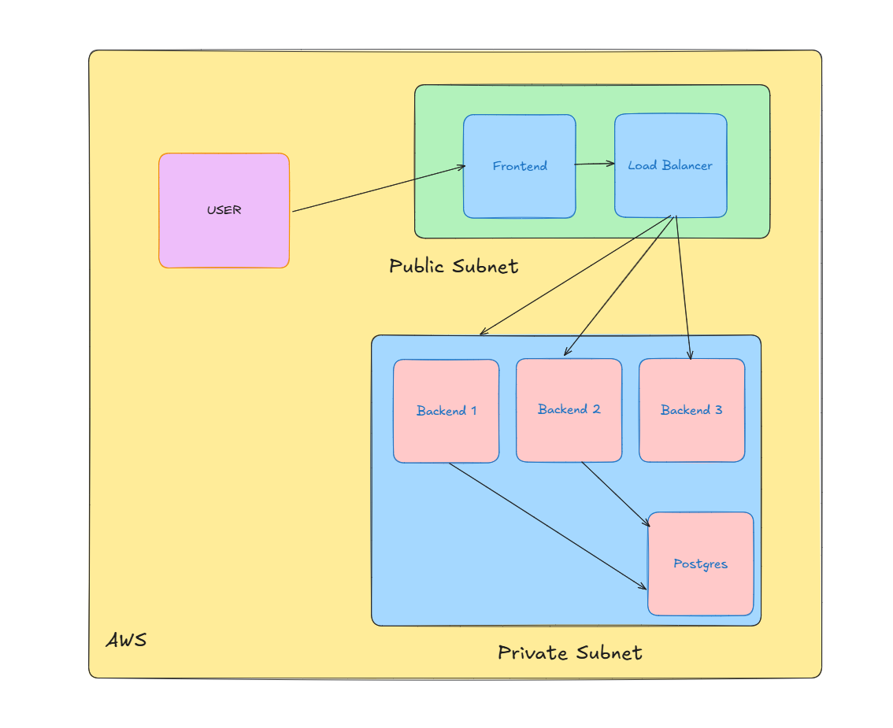

# To-Do Application with Nginx Load Balancer and Pulumi Infrastructure

This is a containerized To-Do Application featuring a React frontend, Node.js backend, and PostgreSQL database. It uses Nginx as a load balancer and is deployed on AWS EC2 instances with infrastructure managed via Pulumi.

---

## Directory Structure

```
TO-DO-APP/
├── app/ # Application directory
│ ├── backend/ # Backend (Node.js + TypeORM)
│ │ ├── src/
│ │ │ ├── controllers/ # Task and User Controllers
│ │ │ ├── database/ # TypeORM data source config
│ │ │ ├── middlewares/ # Custom middlewares
│ │ │ ├── types/ # TypeScript type definitions
│ │ │ └── index.ts # Backend entry point
│ │ ├── .env # Environment variables for backend
│ │ ├── Dockerfile # Backend Dockerfile
│ │ ├── package.json # Backend dependencies
│ │ └── tsconfig.json # TypeScript configuration
│ ├── frontend/ # Frontend (React + TypeScript)
│ │ ├── public/ # Static assets
│ │ ├── src/ # React source code
│ │ ├── .env # Environment variables for frontend
│ │ ├── Dockerfile # Frontend Dockerfile
│ │ ├── package.json # Frontend dependencies
│ │ ├── postcss.config.js # Tailwind CSS config
│ │ └── tailwind.config.js # Tailwind CSS customizations
│ ├── docker-compose.yml # Local Docker setup for both services
│ └── Makefile # Scripts for building and deploying containers
├── infra/ # Pulumi infrastructure setup
│ ├── index.ts # Pulumi entry point
│ ├── Pulumi.dev.yaml # Pulumi dev configuration
│ ├── Pulumi.yaml # Pulumi project metadata
│ └── exam.pem # SSH key for EC2 instances
└── README.md # Project documentation
```

## Features

- **Task Management**:
  - Create, edit, delete and mark tasks as completed.
  - Filter tasks by category, priority, and search term.
- **User Authentication**:
  - Secure login and signup with JWT authentication.
- **Load Balancing**:
  - Nginx distributes traffic across multiple backend instances.
- **Infrastructure as Code**
  - Pulumi automates the provisioning of VPCs, Subnets, EC2 instances, and security groups
- **Containerized Setup**
  - Dockerized frontend and backend services for consistent deployment

## Architecture Overview

### Components

1. Frontend
   - React application served from a public ec2 instance
   - Communicates with the backend via nginx load balancer
2. Backend
   - Node.js RESTful API, deployed across multiple private EC2 instances.
3. Database
   - PostgreSQL hosted on a private EC2 instance.
4. Load Balancer
   - Nginx running on a public EC2 instance, routing traffic to backend services.

### Infrastructure

- Managed via pulumi and deployed on AWS
- Seperate public and private subnets for frontend, backend and database
- Secure access to the database restricted only to backend servers



## Getting Started

1. Prerequisites:
   - AWS account with proper IAM permissions.
   - Pulumi CLI installed
   - Docker installed for containerization
2. Environment Variables
   <br /> Define the following env variables in backend project
   ```
        DB_HOST=<postgres-private-ip>
   DB_PORT=5432
   DB_USER=todo_user
   DB_PASSWORD=secure_password
   DB_NAME=todo_db
   JWT_SECRET=your_jwt_secret
   ```
3. Make sure the backend server is running (Required). For details go to the server directory of this project.

<br />

## How to Use

1. Open LinkedIn Profile:
   - Navigate to any Linkedin profile
2. Extract Emails:

   - Click the extension icon and press the Extract Email Button

   - If an email is found, it will be displayed in the extension popup.

3. Generate LinkedIn Message:
   - After email extraction, it will auto generate the linkedin connection request message based on the profile's work email address
